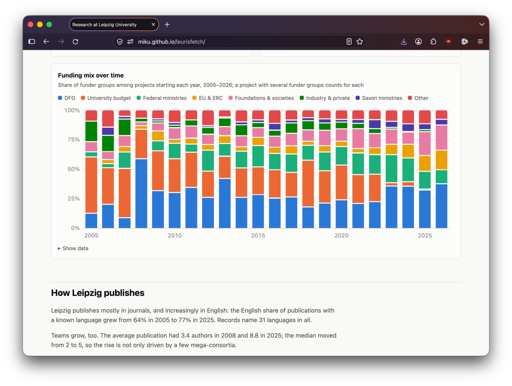

# leurisfetch

Fetch data from [LEURIS](https://leuris.uni-leipzig.de/),
[docs](https://home.uni-leipzig.de/~leuriswiki/doku.php?id=start) and turn it into a [report](https://miku.github.io/leurisfetch/).

    $ make data      # fetch publications.jsonl (200MB+) and projects.jsonl; takes a while
    $ make report    # write report.html and report.md; 5s

[The report](https://miku.github.io/leurisfetch/) covers research areas, a
timeline, funding, publishing habits, people and curiosities. Run `leurisreport
-h` for options; `-f md` (or an output file ending in `.md`) writes Markdown
instead of HTML. Interestingly, data and software as research artifacts are
covered to small extent, only.

[](https://miku.github.io/leurisfetch/)

## Report

* [HTML](https://miku.github.io/leurisfetch/)
* [markdown](report.md)

## Reproduce

```shell
$ git clone https://github.com/miku/leurisfetch.git
$ cd leurisfetch
$ make data report
```

## Deploy

On git push, [report.html](report.html) get copied to branch
[gh-pages'](https://github.com/miku/leurisfetch/tree/gh-pages) index.html.
